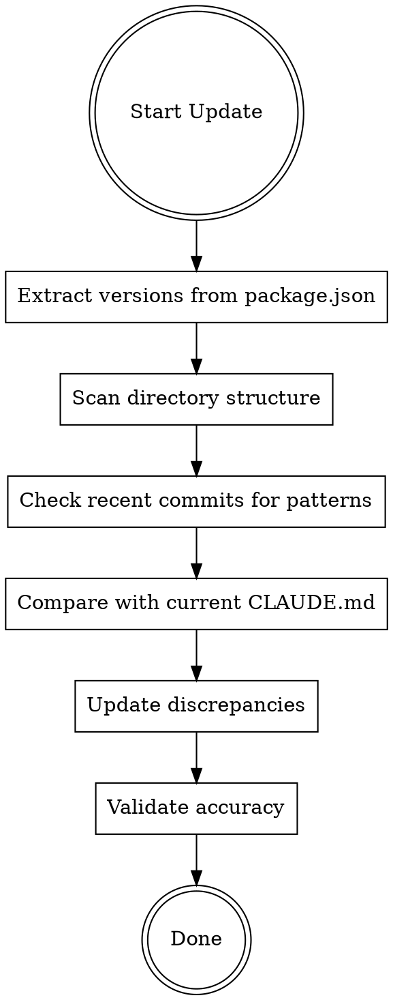

# TDP Update CLAUDE.md

## Overview

Systematic workflow for keeping CLAUDE.md synchronized with actual project state. Covers version extraction, structure scanning, and content validation.

## When to Use

- After upgrading major dependencies (Next.js, React, Prisma)
- After adding new directories or key files
- After establishing new coding patterns or rules
- Periodic review (monthly or per major release)
- When CLAUDE.md feels outdated or incomplete

## Update Workflow



## Step 1: Extract Versions

```bash
# Get key dependency versions
cat package.json | grep -E '"(next|react|prisma|typescript)"'

# Get Node.js requirement
cat package.json | grep -A2 '"engines"'

# Get package manager version
cat package.json | grep '"packageManager"'
```

**Key dependencies to track:**
| Package | Location in CLAUDE.md |
|---------|----------------------|
| next | Tech Stack > Framework |
| react | Tech Stack > Framework |
| @prisma/client | Tech Stack > Database |
| typescript | Tech Stack (if listed) |
| Node.js | Tech Stack > Runtime |
| pnpm | Tech Stack > Runtime |

## Step 2: Scan Directory Structure

```bash
# List top-level src directories
ls -la src/

# Check for new directories
ls -la src/components/
ls -la src/lib/
ls -la src/hooks/
ls -la src/app/api/
```

**Directories to verify in CLAUDE.md:**
- `src/app/` - App Router pages
- `src/components/` - UI components (admin/, gallery/, shared/, zhi/)
- `src/lib/` - Utilities and services
- `src/hooks/` - Custom React hooks
- `src/contexts/` - React contexts
- `src/types/` - TypeScript types
- `prisma/` - Database schema
- `e2e/` - End-to-end tests

## Step 3: Check Recent Commits

```bash
# Recent commits for new patterns
git log --oneline -20

# Count total commits
git rev-list --count HEAD

# Check for new API routes
ls src/app/api/
```

**Update statistics:**
- Total commit count
- Number of Prisma models: `grep -c "^model " prisma/schema.prisma`
- API route categories: `ls src/app/api/ | wc -l`

## Step 4: Compare and Update

Read current CLAUDE.md and compare:

1. **Version mismatches** - Update to actual versions
2. **Missing directories** - Add to file structure
3. **Outdated statistics** - Update commit count, model count
4. **New patterns** - Add if significant and recurring
5. **Deprecated content** - Remove if no longer applicable

## Step 5: Validate

After updating, verify:

```bash
# Versions match package.json
cat package.json | grep '"next"'

# Directories exist
ls -d src/hooks src/contexts src/types 2>/dev/null

# Prisma model count accurate
grep -c "^model " prisma/schema.prisma
```

## CLAUDE.md Section Template

```markdown
## Project Overview
[Project name] is [description] with [X]+ commits.

**Tech Stack:**
- **Framework:** Next.js X.X.X + React X.X.X (App Router)
- **Database:** PostgreSQL + Prisma X.X.X ([N] models)
- **Auth:** NextAuth v5 + [Provider]
- **Runtime:** Node.js >= X.X.X, pnpm X.X.X
- **Styling:** Tailwind CSS + shadcn/ui

## File Structure
src/
├── app/           # App Router
│   ├── [locale]/  # i18n routes
│   └── api/       # API routes
├── components/    # UI components
├── lib/           # Utilities
├── hooks/         # Custom hooks
└── ...

## Key Files
| File | Purpose |
|------|---------|
| CLAUDE.md | Project guidelines |
| ...  | ... |
```

## Checklist

- [ ] Extract versions from package.json
- [ ] Verify Node.js and pnpm versions
- [ ] Scan src/ directory structure
- [ ] Count Prisma models
- [ ] Count API route categories
- [ ] Update commit count
- [ ] Compare each section with actual state
- [ ] Update discrepancies
- [ ] Validate all changes
- [ ] Commit updated CLAUDE.md

## Quick Reference

| Check | Command |
|-------|---------|
| Next.js version | `grep '"next"' package.json` |
| React version | `grep '"react"' package.json` |
| Prisma version | `grep '"@prisma/client"' package.json` |
| Model count | `grep -c "^model " prisma/schema.prisma` |
| Commit count | `git rev-list --count HEAD` |
| API categories | `ls src/app/api/ \| wc -l` |
| Directory exists | `ls -d src/[dir] 2>/dev/null` |
