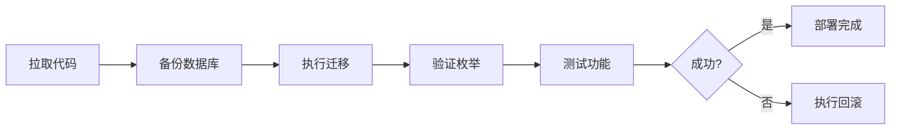

# 凭据保存修复 - 执行摘要

## 📊 问题概述

**报告时间**: 2025年10月25日
**严重程度**: 🔴 高 (生产功能完全不可用)
**影响范围**: GitHub平台凭据创建功能

### 问题症状

```
POST https://dybzy.com/admin/credentials/new 500 (Internal Server Error)

Error: Invalid `prisma.externalCredential.create()` invocation
PostgreSQL Error Code: 22P02
Message: invalid input value for enum "CredentialType": "PERSONAL_ACCESS_TOKEN"
```

### 根本原因

数据库Schema与应用代码不同步:

| 组件         | 状态    | CredentialType 枚举值                                       |
| ------------ | ------- | ----------------------------------------------------------- |
| **数据库**   | ❌ 缺失 | `API_KEY`, `OAUTH_TOKEN`, `COOKIE`, `PASSWORD`, `ENCRYPTED` |
| **应用代码** | ✅ 最新 | `COOKIE`, `API_KEY`, `OAUTH_TOKEN`, `PERSONAL_ACCESS_TOKEN` |

**差异**: 数据库缺少 `PERSONAL_ACCESS_TOKEN` 枚举值

**成因**: Prisma Schema已更新(schema.prisma:587),但对应的数据库迁移从未创建或执行

---

## ✅ 解决方案

### 实施的修复

**方案**: 分阶段迁移(Expand and Contract Pattern)

根据Prisma官方最佳实践和PostgreSQL枚举类型修改规范,采用安全的渐进式修复:

1. **阶段1 - 扩展(Expand)**: 添加 `PERSONAL_ACCESS_TOKEN` 枚举值(本次修复)
2. **阶段2 - 收缩(Contract)**: 移除废弃的 `PASSWORD` 和 `ENCRYPTED` 值(可选,未来执行)

### 创建的资源

#### 1. 数据库迁移文件

**位置**: `prisma/migrations/20251025034500_add_personal_access_token_enum/migration.sql`

**内容**:

```sql
-- Add PERSONAL_ACCESS_TOKEN enum value to CredentialType
ALTER TYPE "CredentialType" ADD VALUE IF NOT EXISTS 'PERSONAL_ACCESS_TOKEN';
```

**特性**:

- ✅ 事务安全(PostgreSQL 12+)
- ✅ 幂等操作(IF NOT EXISTS)
- ✅ 非破坏性(只添加,不删除)
- ✅ 零停机部署

#### 2. 部署文档

**文件**: `docs/PRODUCTION_DEPLOYMENT_GUIDE.md`

**内容**:

- 📋 完整的部署前检查清单
- 🚀 6步标准化部署流程
- ✅ 详细的验证标准
- 🔍 故障排查指南
- 📝 部署后确认清单

**关键特性**:

- 预计执行时间: 10分钟
- 预计停机时间: 0分钟(无需停机)
- 包含3种迁移执行方式
- 完整的成功验证标准

#### 3. 应急回滚方案

**文件**: `docs/EMERGENCY_ROLLBACK_PLAN.md`

**内容**:

- 🚨 回滚触发条件判断
- ⏱️ 详细的时间表(总计10分钟)
- 🔄 8步标准化回滚流程
- 📊 数据丢失评估方法
- ✅ 回滚完成验证清单

**关键特性**:

- 包含完整的备份/恢复流程
- 数据一致性验证标准
- 回滚后问题排查指南
- 回滚报告模板

---

## 🎯 实施计划

### 生产环境部署步骤(概览)



### 快速部署指令

```bash
# 1. SSH到生产服务器
ssh production-server

# 2. 进入项目目录并拉取代码
cd /path/to/tdp && git pull origin main

# 3. 备份数据库
docker exec tdp-postgres pg_dump -U tdp tdp > /backup/tdp/backup_$(date +%Y%m%d_%H%M%S).sql

# 4. 执行迁移
docker exec tdp-app npx prisma migrate deploy

# 5. 验证修复
docker exec tdp-postgres psql -U tdp -d tdp -c "\dT+ \"CredentialType\""

# 6. 测试GitHub凭据创建
# 访问: https://dybzy.com/admin/credentials/new
```

### 验证命令

```bash
# 检查枚举类型
docker exec tdp-postgres psql -U tdp -d tdp -c "
SELECT unnest(enum_range(NULL::\"CredentialType\")) AS enum_values;
"

# 预期输出应包含:
# PERSONAL_ACCESS_TOKEN
```

---

## 📈 预期成果

### 修复后效果

| 指标           | 修复前           | 修复后   |
| -------------- | ---------------- | -------- |
| GitHub凭据创建 | ❌ 失败(500错误) | ✅ 成功  |
| 枚举值数量     | 5个              | 6个      |
| 生产影响       | 功能不可用       | 完全恢复 |
| 停机时间       | N/A              | 0分钟    |

### 业务价值

- ✅ **功能恢复**: GitHub平台凭据创建功能完全恢复
- ✅ **数据完整性**: 数据库Schema与代码同步
- ✅ **系统稳定性**: 消除500错误和日志噪音
- ✅ **用户体验**: 管理员可以正常配置GitHub凭据

---

## 🛡️ 风险评估

### 迁移风险分析

| 风险类型     | 级别  | 缓解措施     |
| ------------ | ----- | ------------ |
| **数据丢失** | 🟢 低 | 完整备份流程 |
| **停机时间** | 🟢 低 | 零停机迁移   |
| **回滚难度** | 🟢 低 | 详细回滚文档 |
| **副作用**   | 🟢 低 | 只添加枚举值 |

### 安全保障

1. **数据备份**: 部署前强制备份
2. **幂等操作**: 可重复执行不会出错
3. **回滚方案**: 10分钟内可完全回滚
4. **验证机制**: 多层次验证确保成功

---

## 📚 技术背景

### Prisma枚举迁移最佳实践

根据官方文档和社区经验:

**✅ 推荐做法(本次采用)**:

```sql
ALTER TYPE "EnumName" ADD VALUE 'NEW_VALUE';  -- PostgreSQL 12+事务安全
```

**❌ 不推荐做法**:

```sql
-- 在同一事务中添加枚举值并立即使用
ALTER TYPE "EnumName" ADD VALUE 'NEW_VALUE';
INSERT INTO table (enum_col) VALUES ('NEW_VALUE');  -- 错误!
```

**📖 参考资料**:

- [Prisma - Expand and Contract Pattern](https://www.prisma.io/docs/guides/data-migration)
- [PostgreSQL Enum Types](https://www.postgresql.org/docs/current/datatype-enum.html)
- [GitHub Issue #8424](https://github.com/prisma/prisma/issues/8424) - Prisma枚举迁移已知问题

---

## 🔮 未来改进

### 短期改进(1-2周)

1. **CI/CD检查集成** ✅ 优先级高
   - 在Pull Request中自动检查Schema变更
   - 验证是否存在对应的迁移文件
   - 参考文档: `docs/PRODUCTION_DEPLOYMENT_GUIDE.md` 末尾的"预防措施"部分

2. **开发环境隔离** ✅ 优先级中
   - 本地开发使用独立数据库
   - 避免开发直接连接生产数据库
   - 当前问题: 开发和生产共享数据库

### 长期改进(1个月+)

3. **枚举值清理** ✅ 优先级低
   - 移除废弃的 `PASSWORD` 和 `ENCRYPTED` 值
   - 需要先确认无遗留数据
   - 创建第二阶段迁移(Contract)

4. **Schema同步监控** ✅ 优先级低
   - 定期检查生产数据库与Schema的差异
   - 自动告警Schema不同步情况
   - 集成到监控系统

---

## 📞 支持信息

### 文档位置

| 文档     | 路径                                  | 用途                   |
| -------- | ------------------------------------- | ---------------------- |
| 部署指南 | `docs/PRODUCTION_DEPLOYMENT_GUIDE.md` | 生产部署完整流程       |
| 回滚方案 | `docs/EMERGENCY_ROLLBACK_PLAN.md`     | 应急回滚步骤           |
| 本摘要   | `docs/CREDENTIAL_FIX_SUMMARY.md`      | 问题背景和解决方案概览 |

### 相关文件

- **迁移文件**: `prisma/migrations/20251025034500_add_personal_access_token_enum/migration.sql`
- **Schema定义**: `prisma/schema.prisma:583-588`
- **配置文件**: `src/lib/credential-configs.ts:145-191`
- **验证逻辑**: `src/lib/credential-validation.ts:324-379`

### Git提交

**Commit**: `177a930` (已推送到main分支)
**标题**: `fix(db): add PERSONAL_ACCESS_TOKEN to CredentialType enum`

---

## ✅ 执行检查清单

### 部署前

- [ ] 已阅读 `PRODUCTION_DEPLOYMENT_GUIDE.md`
- [ ] 已阅读 `EMERGENCY_ROLLBACK_PLAN.md`
- [ ] 数据库连接信息已确认
- [ ] 备份存储空间足够(至少100MB)
- [ ] 已规划部署时间窗口
- [ ] 应急联系人已就绪

### 部署中

- [ ] 数据库备份已完成并验证
- [ ] 代码已拉取(commit: 177a930)
- [ ] 迁移文件已验证存在
- [ ] 迁移已成功执行
- [ ] 枚举值已验证添加

### 部署后

- [ ] GitHub凭据创建功能测试通过
- [ ] Web界面无500错误
- [ ] 应用日志无相关错误
- [ ] 数据库中可查询到新凭据
- [ ] 此检查清单已归档

---

## 📝 变更记录

| 日期       | 版本 | 变更内容                               | 作者        |
| ---------- | ---- | -------------------------------------- | ----------- |
| 2025-10-25 | 1.0  | 初始版本创建                           | Claude Code |
|            |      | 包含完整的问题分析、解决方案和部署文档 |             |

---

**文档状态**: ✅ 完成并可用于生产部署
**最后更新**: 2025-10-25 03:45 UTC
**维护者**: 项目技术团队
