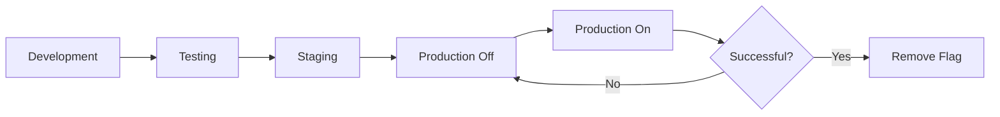

# Feature Flag Operations Manual

## Overview

This manual provides operational guidance for managing feature flags in the TDP application. Feature flags enable runtime control of functionality, allowing for gradual rollouts, A/B testing, and emergency rollback capabilities.

## Feature Flag System

### Architecture

The TDP project uses environment variable-based feature flags with the following components:

1. **Configuration Layer**: `src/config/features.ts`
2. **React Components**: `src/components/feature-toggle.tsx`
3. **Environment Variables**: `.env` files with `FEATURE_*` prefix

### Available Feature Flags

| Flag Name          | Environment Variable        | Purpose                           | Default |
| ------------------ | --------------------------- | --------------------------------- | ------- |
| `adminCredentials` | `FEATURE_ADMIN_CREDENTIALS` | Credentials management system     | `on` ✅ |
| `adminDashboard`   | `FEATURE_ADMIN_DASHBOARD`   | Dashboard statistics & metrics    | `on` ✅ |
| `adminAnalytics`   | `FEATURE_ADMIN_ANALYTICS`   | Analytics dashboard               | `on` ✅ |
| `adminGallery`     | `FEATURE_ADMIN_GALLERY`     | Gallery management in admin panel | `on` ✅ |
| `adminPosts`       | `FEATURE_ADMIN_POSTS`       | Posts management in admin panel   | `on` ✅ |
| `adminSync`        | `FEATURE_ADMIN_SYNC`        | External platform sync            | `on` ✅ |
| `adminExport`      | `FEATURE_ADMIN_EXPORT`      | Data export tools                 | `on` ✅ |
| `galleryInsights`  | `FEATURE_GALLERY_INSIGHTS`  | Gallery insights & analytics      | `on` ✅ |

## Operations Guide

### Checking Feature Status

#### In Application Code

```typescript
import { features } from "@/config/features";

if (features.get("adminPosts")) {
  // Feature is enabled
}
```

#### In Environment

```bash
# Check current .env settings
grep FEATURE_ .env

# Check environment variables in running process
env | grep FEATURE_
```

### Default Behavior (v2.0+)

**All features are ENABLED by default.** You don't need to set any environment variables unless you want to disable specific features.

### Disabling a Feature

#### Development Environment

1. Edit `.env` file to explicitly disable:

```bash
FEATURE_ADMIN_POSTS=off
```

2. Restart the development server:

```bash
npm run dev
```

### Enabling a Feature (Legacy/Override)

Features are enabled by default. Only needed if previously disabled:

#### Production Environment

1. Update environment variables in deployment platform (Vercel, Docker, etc.)

2. For Vercel:

```bash
# Using Vercel CLI
vercel env add FEATURE_ADMIN_POSTS production
> on
```

3. Redeploy the application:

```bash
vercel --prod
```

4. Verify the feature is enabled by checking the UI

### Disabling a Feature

#### Emergency Rollback

If a feature causes issues in production:

1. **Immediate Action** - Update environment variable:

```bash
FEATURE_ADMIN_POSTS=off
```

2. **Redeploy**:

```bash
# Vercel
vercel --prod

# Docker
docker-compose up -d --force-recreate
```

3. **Verify** - Check that the feature is disabled

4. **Document** - Record the incident and reason for rollback

#### Planned Disable

1. Announce the change to the team
2. Update `.env` file
3. Commit the change
4. Deploy through normal CI/CD process
5. Monitor for any issues

### Feature Flag Lifecycle



#### Stage 1: Development

```bash
# Enable in local .env
FEATURE_NEW_FEATURE=on
```

- Develop the feature
- Write tests
- Test locally

#### Stage 2: Testing

```bash
# Enable in CI environment
FEATURE_NEW_FEATURE=on
```

- Run CI/CD tests
- Verify integration tests pass
- Run E2E tests

#### Stage 3: Staging

```bash
# Enable in staging environment
FEATURE_NEW_FEATURE=on
```

- Deploy to staging
- Run smoke tests
- QA validation
- Stakeholder review

#### Stage 4: Production (Off by Default)

```bash
# Deploy with feature OFF in production
FEATURE_NEW_FEATURE=off
```

- Deploy code to production
- Feature exists but is disabled
- Monitor application stability

#### Stage 5: Production (On)

```bash
# Enable in production
FEATURE_NEW_FEATURE=on
```

- Enable the feature
- Monitor metrics
- Watch for errors
- Gather user feedback

#### Stage 6: Cleanup

After feature proves stable (usually 2-4 weeks):

1. Remove the feature flag check from code
2. Remove the environment variable
3. Update documentation

## Monitoring and Logging

### Feature Flag Events

The application logs feature flag state changes:

```typescript
// Recommended logging format
console.info("[feature:on] adminPosts", {
  timestamp: new Date().toISOString(),
  environment: process.env.NODE_ENV,
  userId: user?.id,
});
```

### Monitoring Checklist

When enabling a feature, monitor:

- [ ] Error rates in application logs
- [ ] API response times
- [ ] Database query performance
- [ ] User activity on the new feature
- [ ] Browser console errors (if frontend feature)
- [ ] Memory and CPU usage

### Recommended Monitoring Tools

If using external monitoring:

#### Sentry Configuration

```javascript
// Add feature flag context to Sentry
Sentry.configureScope((scope) => {
  scope.setTag("feature.adminPosts", features.get("adminPosts") ? "on" : "off");
  scope.setTag("environment", process.env.NODE_ENV);
});
```

#### Custom Logging

```typescript
// Log feature access
function logFeatureAccess(featureName: string) {
  console.info(`[feature:access] ${featureName}`, {
    timestamp: new Date().toISOString(),
    userId: getCurrentUserId(),
    environment: process.env.NODE_ENV,
  });
}
```

## Best Practices

### DO

✅ **Start with feature OFF in production**

- Deploy code with the feature disabled
- Enable after verifying deployment stability

✅ **Use descriptive flag names**

- `FEATURE_ADMIN_POSTS` ✓
- `FEATURE_FLAG_1` ✗

✅ **Document the purpose**

- Add comments in `.env.example`
- Update this operations manual

✅ **Test both states**

- Write tests for enabled state
- Write tests for disabled state

✅ **Clean up old flags**

- Remove flags after 2-4 weeks of stability
- Archive flag history in git

✅ **Monitor after enabling**

- Watch metrics for 24-48 hours
- Keep rollback plan ready

### DON'T

❌ **Don't nest feature flags deeply**

```typescript
// Bad
if (features.get("adminPosts")) {
  if (features.get("adminPostsAdvanced")) {
    if (features.get("adminPostsExperimental")) {
      // Too complex
    }
  }
}
```

❌ **Don't use feature flags for configuration**

```typescript
// Bad - use environment variables instead
FEATURE_API_URL=https://api.example.com
```

❌ **Don't leave flags indefinitely**

- Maximum lifetime: 3 months
- Remove after feature stabilizes

❌ **Don't forget the disabled state UI**

```typescript
// Bad - just returns null
if (!features.get("adminPosts")) return null;

// Good - show appropriate message
if (!features.get("adminPosts")) {
  return <FeatureDisabledMessage feature="Posts Management" />;
}
```

## Rollback Procedures

### Emergency Rollback

If a feature causes critical issues:

#### Step 1: Disable Feature (< 2 minutes)

```bash
# Vercel
vercel env add FEATURE_PROBLEMATIC_FEATURE production
> off
vercel --prod

# Docker
docker exec -it tdp-web sh -c 'export FEATURE_PROBLEMATIC_FEATURE=off'
docker-compose restart
```

#### Step 2: Verify (< 5 minutes)

1. Check application is accessible
2. Verify feature is disabled in UI
3. Monitor error rates dropping

#### Step 3: Communicate (< 10 minutes)

1. Notify team in Slack/Discord
2. Update status page if public-facing
3. Document the incident

#### Step 4: Investigate

1. Review logs for root cause
2. Identify the problematic code
3. Create fix in development
4. Test thoroughly before re-enabling

### Gradual Rollback

If issues are non-critical but concerning:

1. **Monitor**: Watch metrics closely
2. **Evaluate**: Determine if issues are related to the feature
3. **Decide**: Coordinate with team on rollback timing
4. **Execute**: Disable feature during low-traffic period
5. **Review**: Conduct post-mortem and plan fixes

## Examples

### Example 1: Rolling Out Gallery Management

```bash
# Week 1: Development
FEATURE_ADMIN_GALLERY=on  # Local only

# Week 2: Testing
FEATURE_ADMIN_GALLERY=on  # CI + Staging

# Week 3: Soft Launch
FEATURE_ADMIN_GALLERY=off  # Production (code deployed, feature off)

# Week 4: Enable
FEATURE_ADMIN_GALLERY=on  # Production enabled

# Week 6: Cleanup (after 2 weeks of stability)
# Remove flag from code
# Remove from environment variables
```

### Example 2: Emergency Rollback

```bash
# Issue detected at 14:30
# User reports: "Gallery page is down"

# 14:32 - Disable feature
vercel env add FEATURE_ADMIN_GALLERY production
> off
vercel --prod

# 14:35 - Verify
curl https://app.example.com/admin/gallery
# Returns "Gallery Management is currently disabled"

# 14:37 - Notify team
# Slack: "🚨 FEATURE_ADMIN_GALLERY disabled due to 500 errors. Investigating."

# 14:45 - Review logs
# Found: Database query timeout in gallery image list

# Next day - Fix and re-enable
git commit -m "fix: optimize gallery query with pagination"
# After thorough testing, re-enable feature
```

## Feature Flag Checklist

Use this checklist when introducing a new feature flag:

### Planning Phase

- [ ] Feature name chosen (descriptive, clear)
- [ ] Purpose documented
- [ ] Rollout plan created
- [ ] Rollback procedure defined
- [ ] Monitoring plan established

### Implementation Phase

- [ ] Flag added to `src/config/features.ts`
- [ ] Environment variable documented in `.env.example`
- [ ] Tests written for enabled state
- [ ] Tests written for disabled state
- [ ] UI handles disabled state gracefully

### Deployment Phase

- [ ] Code deployed with flag OFF
- [ ] Deployment verified stable
- [ ] Flag enabled in production
- [ ] Monitoring active (24-48 hours)
- [ ] No critical issues detected

### Cleanup Phase

- [ ] Feature stable for 2+ weeks
- [ ] Flag checks removed from code
- [ ] Environment variables removed
- [ ] Documentation updated
- [ ] Team notified of cleanup

## References

- [Feature Toggle Configuration](../src/config/features.ts)
- [Modular Development Playbook](./modular-development-playbook.md)
- [E2E Scaling Guide](./E2E_SCALING_GUIDE.md)
- [Environment Configuration](./../.env.example)
