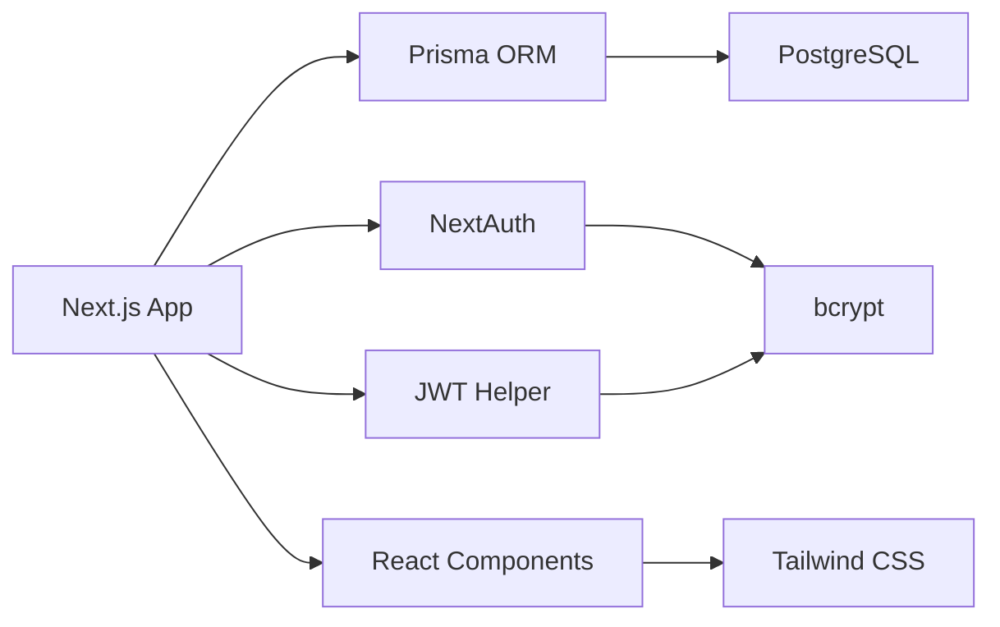
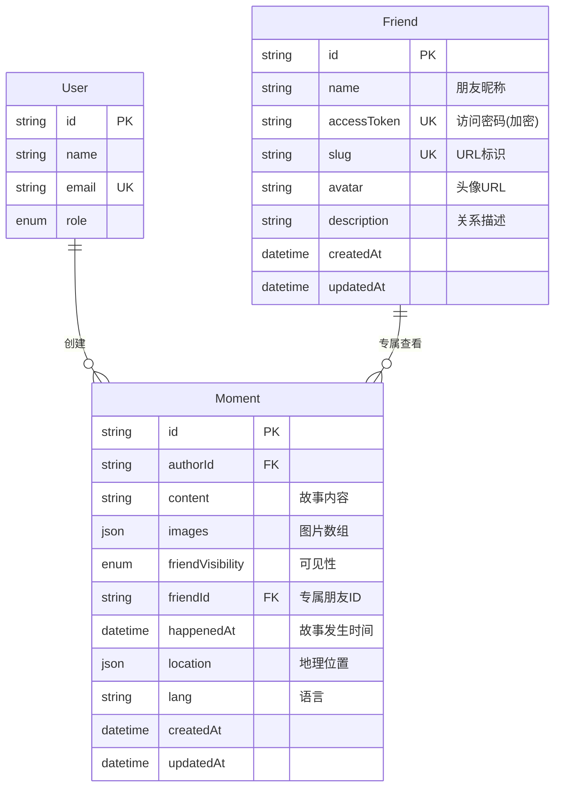
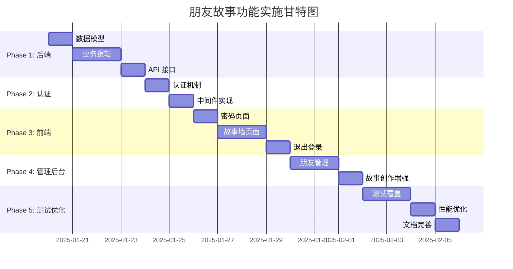

# 朋友故事页面功能 - 技术规格文档

> **版本**: 1.0.0
> **创建日期**: 2025-01-15
> **状态**: 设计阶段
> **负责人**: 王浩

## 📋 目录

- [功能概述](#功能概述)
- [技术架构](#技术架构)
- [数据库设计](#数据库设计)
- [API 接口设计](#api-接口设计)
- [认证授权机制](#认证授权机制)
- [路由和页面结构](#路由和页面结构)
- [组件架构](#组件架构)
- [安全性设计](#安全性设计)
- [性能优化](#性能优化)
- [实施路线图](#实施路线图)

---

## 功能概述

### 产品需求背景

为朋友们创建专属的个人页面，展示我和他们的故事。每个朋友通过独立密码访问，可以看到：

- **公共故事**：所有朋友都能看到的共享回忆
- **专属故事**：仅为特定朋友准备的私密内容

### 核心功能特性

✅ **密码访问控制**：每个朋友有独立的访问密码
✅ **混合可见性**：支持公共故事和专属故事
✅ **多媒体支持**：文字、图片、地理位置、时间标记
✅ **管理后台**：便捷的朋友管理和故事创作界面
✅ **安全可靠**：密码加密、访问日志、防暴力破解

### 用户角色

| 角色               | 权限     | 说明                         |
| ------------------ | -------- | ---------------------------- |
| **管理员（我）**   | 完全控制 | 创建朋友、发布故事、管理权限 |
| **朋友（访问者）** | 受限访问 | 输入密码后查看对应的故事内容 |

---

## 技术架构

### 整体架构图

```mermaid
graph TB
    subgraph "前端层"
        A[朋友访问页面<br/>/m/friends]
        B[密码验证表单<br/>FriendAuthForm]
        C[故事墙页面<br/>/m/friends/alice]
        D[管理后台<br/>/admin/friends]
    end

    subgraph "API 层"
        E[POST /api/friends/auth<br/>密码验证]
        F[GET /api/friends/[slug]<br/>获取朋友信息]
        G[GET /api/moments<br/>故事列表]
        H[POST /api/friends<br/>创建朋友]
    end

    subgraph "业务逻辑层"
        I[friends.ts<br/>朋友管理逻辑]
        J[moments.ts<br/>故事查询逻辑]
        K[auth-helper.ts<br/>JWT 认证]
    end

    subgraph "数据层"
        L[(PostgreSQL)]
        M[Friend 表]
        N[Moment 表]
    end

    A --> B
    B --> E
    E --> I
    C --> G
    G --> J
    D --> H
    H --> I
    I --> M
    J --> N
    M --> L
    N --> L
    K -.验证 Cookie.-> C
```

### 技术栈

| 类别         | 技术选型     | 版本    | 说明                                 |
| ------------ | ------------ | ------- | ------------------------------------ |
| **前端框架** | Next.js      | 15.x    | App Router + React Server Components |
| **UI 库**    | React        | 19.x    | 最新稳定版                           |
| **样式**     | Tailwind CSS | 4.x     | PostCSS 插件模式                     |
| **数据库**   | PostgreSQL   | -       | 通过 Prisma ORM 访问                 |
| **ORM**      | Prisma       | 6.18.0  | 类型安全的数据库访问                 |
| **认证**     | NextAuth     | 4.24.11 | 扩展支持朋友密码认证                 |
| **密码加密** | bcrypt       | 5.x     | 密码哈希加密                         |
| **JWT**      | jsonwebtoken | 9.x     | Cookie 签名和验证                    |
| **语言**     | TypeScript   | 5.x     | 完整类型安全                         |

### 依赖关系



---

## 数据库设计

### ER 图



### Friend 模型（新增）

```prisma
model Friend {
  id           String   @id @default(cuid())
  name         String   // 朋友昵称，如 "Alice"
  accessToken  String   @unique  // bcrypt 加密的密码哈希
  slug         String   @unique  // URL 友好标识，如 "alice"
  avatar       String?  // 头像 URL（可选）
  description  String?  // 关系描述，如 "高中同学"
  createdAt    DateTime @default(now())
  updatedAt    DateTime @updatedAt

  // 关联：专属故事
  privateMoments Moment[] @relation("FriendPrivateMoments")

  // 索引优化
  @@index([slug])
  @@index([accessToken])
}
```

**字段说明：**

| 字段          | 类型     | 约束             | 说明                               |
| ------------- | -------- | ---------------- | ---------------------------------- |
| `id`          | String   | PK, CUID         | 主键，使用 CUID 生成               |
| `name`        | String   | NOT NULL         | 朋友昵称（用于显示）               |
| `accessToken` | String   | UNIQUE, NOT NULL | bcrypt 加密后的密码哈希            |
| `slug`        | String   | UNIQUE, NOT NULL | URL 标识（如 alice），用于访问路径 |
| `avatar`      | String   | NULLABLE         | 头像图片 URL                       |
| `description` | String   | NULLABLE         | 关系描述或备注                     |
| `createdAt`   | DateTime | DEFAULT now()    | 创建时间                           |
| `updatedAt`   | DateTime | AUTO UPDATE      | 更新时间                           |

### Moment 模型（扩展）

```prisma
model Moment {
  id                String            @id @default(cuid())
  authorId          String            // 作者 ID（管理员）
  content           String            // 故事内容
  images            Json?             // 图片数组 MomentImage[]

  // 原有字段
  visibility        MomentVisibility  @default(PUBLIC)
  slug              String?           @unique
  tags              String[]
  location          Json?             // {name: string, lat: number, lng: number}
  lang              String            @default("zh-CN")
  status            MomentStatus      @default(PUBLISHED)
  scheduledAt       DateTime?
  replyToId         String?
  createdAt         DateTime          @default(now())
  updatedAt         DateTime          @updatedAt
  deletedAt         DateTime?

  // ===== 新增字段 =====
  friendVisibility  FriendVisibility  @default(PUBLIC)  // 朋友可见性
  friendId          String?           // 专属朋友 ID（仅 FRIEND_ONLY 时有值）
  happenedAt        DateTime?         // 故事实际发生时间

  // 关系
  author    User     @relation(fields: [authorId], references: [id])
  friend    Friend?  @relation("FriendPrivateMoments", fields: [friendId], references: [id])
  replyTo   Moment?  @relation("MomentThread", fields: [replyToId])
  replies   Moment[] @relation("MomentThread")

  // 索引优化
  @@index([authorId])
  @@index([friendVisibility, friendId])  // 关键：朋友故事查询
  @@index([happenedAt])                  // 按发生时间排序
  @@index([status, visibility, friendVisibility])
}
```

**新增枚举类型：**

```prisma
enum FriendVisibility {
  PUBLIC       // 所有朋友可见（公共故事）
  FRIEND_ONLY  // 仅特定朋友可见（专属故事）
  PRIVATE      // 完全私密（仅管理员可见，不对朋友开放）
}
```

**字段说明：**

| 新增字段           | 类型             | 默认值 | 说明                                                    |
| ------------------ | ---------------- | ------ | ------------------------------------------------------- |
| `friendVisibility` | FriendVisibility | PUBLIC | 朋友可见性级别                                          |
| `friendId`         | String?          | NULL   | 专属朋友 ID（仅当 friendVisibility=FRIEND_ONLY 时必填） |
| `happenedAt`       | DateTime?        | NULL   | 故事实际发生的时间（区别于 createdAt 创建时间）         |

### 数据库迁移脚本

```sql
-- Migration: 添加 Friend 表和 Moment 扩展字段
-- File: prisma/migrations/YYYYMMDDHHMMSS_add_friend_stories/migration.sql

-- 1. 创建朋友可见性枚举
CREATE TYPE "FriendVisibility" AS ENUM ('PUBLIC', 'FRIEND_ONLY', 'PRIVATE');

-- 2. 创建 Friend 表
CREATE TABLE "Friend" (
    "id" TEXT NOT NULL,
    "name" TEXT NOT NULL,
    "accessToken" TEXT NOT NULL,
    "slug" TEXT NOT NULL,
    "avatar" TEXT,
    "description" TEXT,
    "createdAt" TIMESTAMP(3) NOT NULL DEFAULT CURRENT_TIMESTAMP,
    "updatedAt" TIMESTAMP(3) NOT NULL,

    CONSTRAINT "Friend_pkey" PRIMARY KEY ("id")
);

-- 3. 为 Moment 表添加新字段
ALTER TABLE "Moment"
ADD COLUMN "friendVisibility" "FriendVisibility" NOT NULL DEFAULT 'PUBLIC',
ADD COLUMN "friendId" TEXT,
ADD COLUMN "happenedAt" TIMESTAMP(3);

-- 4. 创建唯一索引
CREATE UNIQUE INDEX "Friend_accessToken_key" ON "Friend"("accessToken");
CREATE UNIQUE INDEX "Friend_slug_key" ON "Friend"("slug");

-- 5. 创建普通索引
CREATE INDEX "Friend_slug_idx" ON "Friend"("slug");
CREATE INDEX "Friend_accessToken_idx" ON "Friend"("accessToken");
CREATE INDEX "Moment_friendVisibility_friendId_idx" ON "Moment"("friendVisibility", "friendId");
CREATE INDEX "Moment_happenedAt_idx" ON "Moment"("happenedAt");

-- 6. 添加外键约束
ALTER TABLE "Moment"
ADD CONSTRAINT "Moment_friendId_fkey"
FOREIGN KEY ("friendId") REFERENCES "Friend"("id")
ON DELETE SET NULL ON UPDATE CASCADE;

-- 7. 添加检查约束（确保 FRIEND_ONLY 时必有 friendId）
ALTER TABLE "Moment"
ADD CONSTRAINT "Moment_friend_only_check"
CHECK (
  ("friendVisibility" != 'FRIEND_ONLY') OR
  ("friendVisibility" = 'FRIEND_ONLY' AND "friendId" IS NOT NULL)
);
```

### 索引优化策略

```sql
-- 朋友故事查询（最常用）
-- 查询：WHERE friendVisibility IN ('PUBLIC', 'FRIEND_ONLY') AND friendId = ?
CREATE INDEX "idx_moment_friend_query"
ON "Moment"("friendVisibility", "friendId");

-- 时间排序
-- 查询：ORDER BY happenedAt DESC
CREATE INDEX "idx_moment_happened_at"
ON "Moment"("happenedAt" DESC);

-- 管理后台查询
-- 查询：WHERE authorId = ? AND friendVisibility = ?
CREATE INDEX "idx_moment_admin_query"
ON "Moment"("authorId", "friendVisibility");

-- 复合索引（覆盖索引）
-- 查询：SELECT id, content, happenedAt WHERE friendId = ? AND status = 'PUBLISHED'
CREATE INDEX "idx_moment_friend_published"
ON "Moment"("friendId", "status", "happenedAt" DESC)
INCLUDE ("id", "content");
```

---

## API 接口设计

### RESTful API 端点

#### 1. 朋友认证 API

**POST /api/friends/auth**

验证朋友密码并生成访问 Token。

```typescript
// 请求
POST /api/friends/auth
Content-Type: application/json

{
  "slug": "alice",
  "password": "summer2024"
}

// 成功响应（200 OK）
{
  "success": true,
  "token": "eyJhbGciOiJIUzI1NiIsInR5cCI6IkpXVCJ9...",
  "friend": {
    "id": "cm1abc123",
    "name": "Alice",
    "slug": "alice",
    "avatar": "https://...",
    "description": "高中同学"
  }
}

// 失败响应（401 Unauthorized）
{
  "success": false,
  "error": "密码错误",
  "attemptsRemaining": 2  // 剩余尝试次数
}

// 失败响应（429 Too Many Requests）
{
  "success": false,
  "error": "尝试次数过多，请 30 分钟后再试"
}
```

**实现要点：**

- 使用 bcrypt 验证密码哈希
- 生成 JWT Token（有效期 30 天）
- 设置 HttpOnly Cookie
- 记录访问日志
- 实现速率限制（10 次/小时）

---

#### 2. 获取朋友信息 API

**GET /api/friends/[slug]**

根据 slug 获取朋友基本信息（无需认证）。

```typescript
// 请求
GET /api/friends/alice

// 成功响应（200 OK）
{
  "id": "cm1abc123",
  "name": "Alice",
  "slug": "alice",
  "avatar": "https://...",
  "description": "高中同学",
  "createdAt": "2024-01-01T00:00:00Z"
}

// 失败响应（404 Not Found）
{
  "error": "朋友不存在"
}
```

---

#### 3. 获取朋友故事列表 API

**GET /api/moments?friendId=xxx**

获取朋友可见的故事列表（需要认证）。

```typescript
// 请求
GET /api/moments?friendId=cm1abc123&limit=20&cursor=cm2xyz789
Cookie: friendAuth=eyJhbGci...

// 成功响应（200 OK）
{
  "moments": [
    {
      "id": "cm2moment1",
      "content": "还记得那个雨天吗？",
      "images": [
        {
          "url": "https://...",
          "width": 1920,
          "height": 1080
        }
      ],
      "friendVisibility": "FRIEND_ONLY",
      "happenedAt": "2023-06-15T14:30:00Z",
      "location": {
        "name": "咖啡厅",
        "lat": 39.9042,
        "lng": 116.4074
      },
      "tags": ["回忆", "雨天"],
      "createdAt": "2024-01-10T10:00:00Z"
    },
    {
      "id": "cm2moment2",
      "content": "我们的旅行记忆",
      "friendVisibility": "PUBLIC",
      "happenedAt": "2023-08-20T00:00:00Z",
      // ...
    }
  ],
  "nextCursor": "cm2xyz456",
  "hasMore": true
}

// 失败响应（401 Unauthorized）
{
  "error": "未授权访问，请先输入密码"
}
```

**查询逻辑：**

```sql
SELECT * FROM Moment
WHERE (
  friendVisibility = 'PUBLIC' OR
  (friendVisibility = 'FRIEND_ONLY' AND friendId = $1)
)
AND status = 'PUBLISHED'
AND deletedAt IS NULL
ORDER BY happenedAt DESC
LIMIT $2
```

---

#### 4. 退出登录 API

**POST /api/friends/logout**

清除朋友认证 Cookie。

```typescript
// 请求
POST /api/friends/logout

// 成功响应（200 OK）
{
  "success": true
}
```

**实现：**

- 清除 `friendAuth` Cookie
- 设置 `Max-Age=0`

---

### Server Actions（管理后台）

#### 1. 创建朋友

```typescript
// src/app/admin/friends/actions.ts
"use server";

export async function createFriend(data: {
  name: string;
  slug: string;
  password: string;
  avatar?: string;
  description?: string;
}) {
  const session = await auth();
  if (!isAdmin(session)) {
    throw new Error("Unauthorized");
  }

  // 加密密码
  const hashedPassword = await bcrypt.hash(data.password, 12);

  // 创建朋友
  const friend = await prisma.friend.create({
    data: {
      name: data.name,
      slug: data.slug,
      accessToken: hashedPassword,
      avatar: data.avatar,
      description: data.description,
    },
  });

  return friend;
}
```

#### 2. 更新朋友密码

```typescript
export async function updateFriendPassword(friendId: string, newPassword: string) {
  const session = await auth();
  if (!isAdmin(session)) {
    throw new Error("Unauthorized");
  }

  const hashedPassword = await bcrypt.hash(newPassword, 12);

  await prisma.friend.update({
    where: { id: friendId },
    data: { accessToken: hashedPassword },
  });
}
```

#### 3. 创建朋友专属故事

```typescript
export async function createMoment(data: {
  content: string;
  friendVisibility: "PUBLIC" | "FRIEND_ONLY" | "PRIVATE";
  friendId?: string;
  happenedAt?: Date;
  images?: MomentImage[];
  location?: { name: string; lat: number; lng: number };
  tags?: string[];
}) {
  const session = await auth();
  if (!isAdmin(session)) {
    throw new Error("Unauthorized");
  }

  // 验证：FRIEND_ONLY 必须指定 friendId
  if (data.friendVisibility === "FRIEND_ONLY" && !data.friendId) {
    throw new Error("专属故事必须指定朋友");
  }

  const moment = await prisma.moment.create({
    data: {
      authorId: session.user.id,
      content: data.content,
      friendVisibility: data.friendVisibility,
      friendId: data.friendId,
      happenedAt: data.happenedAt,
      images: data.images,
      location: data.location,
      tags: data.tags,
      status: "PUBLISHED",
    },
  });

  return moment;
}
```

---

## 认证授权机制

### JWT Cookie 方案

#### Cookie 配置

```typescript
// src/lib/cookie-config.ts
export const FRIEND_AUTH_COOKIE = {
  name: "friendAuth",
  maxAge: 30 * 24 * 60 * 60, // 30 天
  httpOnly: true, // 防止 XSS 攻击
  secure: process.env.NODE_ENV === "production", // 生产环境强制 HTTPS
  sameSite: "lax" as const, // CSRF 防护
  path: "/m/friends", // 仅朋友页面携带
};
```

#### JWT Payload 结构

```typescript
interface FriendJWTPayload {
  friendId: string; // 朋友 ID
  slug: string; // slug（便于调试）
  iat: number; // 签发时间
  exp: number; // 过期时间
}
```

#### Token 生成和验证

```typescript
// src/lib/friend-auth.ts
import jwt from "jsonwebtoken";

const JWT_SECRET = process.env.FRIEND_JWT_SECRET!;

export function generateFriendToken(friend: Friend): string {
  const payload: FriendJWTPayload = {
    friendId: friend.id,
    slug: friend.slug,
    iat: Math.floor(Date.now() / 1000),
    exp: Math.floor(Date.now() / 1000) + 30 * 24 * 60 * 60,
  };

  return jwt.sign(payload, JWT_SECRET, { algorithm: "HS256" });
}

export function verifyFriendToken(token: string): FriendJWTPayload | null {
  try {
    return jwt.verify(token, JWT_SECRET) as FriendJWTPayload;
  } catch (error) {
    return null;
  }
}
```

### 认证流程图

```mermaid
sequenceDiagram
    participant User as 朋友
    participant Browser as 浏览器
    participant Server as 服务器
    participant DB as 数据库

    User->>Browser: 访问 /m/friends
    Browser->>Server: GET /m/friends
    Server-->>Browser: 返回密码输入页面

    User->>Browser: 输入密码 "summer2024"
    Browser->>Server: POST /api/friends/auth {slug, password}
    Server->>DB: 查询 Friend WHERE slug = "alice"
    DB-->>Server: 返回 Friend 数据（包含 hashedPassword）

    Server->>Server: bcrypt.compare(password, hashedPassword)
    alt 密码正确
        Server->>Server: 生成 JWT Token
        Server-->>Browser: Set-Cookie: friendAuth=<token>; HttpOnly
        Browser->>Browser: 存储 Cookie
        Browser->>Server: 跳转到 /m/friends/alice
        Server->>Server: 验证 Cookie 中的 JWT
        Server->>DB: 查询朋友故事
        DB-->>Server: 返回故事列表
        Server-->>Browser: 渲染故事墙页面
    else 密码错误
        Server->>Server: 记录失败尝试
        Server-->>Browser: 401 错误 + 剩余尝试次数
        Browser-->>User: 显示错误提示
    end
```

### 中间件实现

```typescript
// src/middleware/friend-auth.ts
import { NextRequest, NextResponse } from "next/server";
import { verifyFriendToken } from "@/lib/friend-auth";

export function friendAuthMiddleware(request: NextRequest) {
  const { pathname } = request.nextUrl;

  // 仅保护 /m/friends/[slug] 路径
  if (!pathname.match(/^\/[^\/]+\/m\/friends\/[^\/]+/)) {
    return NextResponse.next();
  }

  // 提取 slug
  const slug = pathname.split("/").pop();

  // 获取 Cookie
  const token = request.cookies.get("friendAuth")?.value;

  if (!token) {
    // 未登录，重定向到密码页面
    return NextResponse.redirect(new URL("/m/friends", request.url));
  }

  // 验证 JWT
  const payload = verifyFriendToken(token);

  if (!payload || payload.slug !== slug) {
    // Token 无效或不匹配，重定向
    return NextResponse.redirect(new URL("/m/friends", request.url));
  }

  // 验证通过，添加 friendId 到请求头
  const response = NextResponse.next();
  response.headers.set("x-friend-id", payload.friendId);

  return response;
}
```

---

## 路由和页面结构

### 路由映射表

| 路由                         | 文件路径                                     | 功能         | 访问控制   |
| ---------------------------- | -------------------------------------------- | ------------ | ---------- |
| `/[locale]/m/friends`        | `src/app/[locale]/m/friends/page.tsx`        | 密码验证页面 | 公开       |
| `/[locale]/m/friends/[slug]` | `src/app/[locale]/m/friends/[slug]/page.tsx` | 朋友故事墙   | JWT Cookie |
| `/[locale]/m/friends/logout` | `src/app/[locale]/m/friends/logout/page.tsx` | 退出登录     | 无限制     |
| `/admin/friends`             | `src/app/admin/friends/page.tsx`             | 朋友管理列表 | Admin Only |
| `/admin/friends/create`      | `src/app/admin/friends/create/page.tsx`      | 创建朋友     | Admin Only |
| `/admin/friends/[id]`        | `src/app/admin/friends/[id]/page.tsx`        | 编辑朋友     | Admin Only |

### 页面组件层级

```
app/
└── [locale]/
    └── m/
        ├── page.tsx                  # 公开朋友圈（现有）
        └── friends/
            ├── page.tsx              # 密码验证页面
            │   └── <FriendAuthForm />
            ├── [slug]/
            │   └── page.tsx          # 朋友故事墙
            │       └── <FriendMomentTimeline />
            │           ├── <FriendHeader />
            │           ├── <MomentCard /> (复用)
            │           └── <LoadMoreButton />
            └── logout/
                └── page.tsx          # 退出登录确认
```

---

## 组件架构

### 核心组件清单

#### 1. FriendAuthForm（密码验证表单）

**路径**: `src/components/friends/FriendAuthForm.tsx`

```typescript
interface FriendAuthFormProps {
  onSuccess?: (friend: Friend) => void;
  redirectUrl?: string;
}
```

**功能**：

- 输入 slug 和密码
- 调用 `/api/friends/auth` 验证
- 显示错误提示和剩余尝试次数
- 成功后自动跳转

---

#### 2. FriendMomentTimeline（朋友故事时间线）

**路径**: `src/components/friends/FriendMomentTimeline.tsx`

```typescript
interface FriendMomentTimelineProps {
  friend: Friend;
  initialMoments: Moment[];
  nextCursor?: string;
}
```

**功能**：

- 展示公共故事和专属故事
- 按 `happenedAt` 时间排序
- 专属故事显示特殊徽章
- 支持无限滚动加载

---

#### 3. FriendHeader（朋友信息头部）

**路径**: `src/components/friends/FriendHeader.tsx`

```typescript
interface FriendHeaderProps {
  friend: Friend;
  onLogout?: () => void;
}
```

**功能**：

- 显示朋友头像、昵称、关系描述
- 显示退出登录按钮

---

#### 4. PublicBadge 和 PrivateBadge（可见性标记）

**路径**: `src/components/friends/VisibilityBadge.tsx`

```typescript
<PublicBadge />   // 显示 "🌍 公开故事"
<PrivateBadge />  // 显示 "🔒 专属故事"
```

---

#### 5. FriendManagementTable（管理后台表格）

**路径**: `src/components/admin/FriendManagementTable.tsx`

```typescript
interface FriendManagementTableProps {
  friends: Friend[];
  onEdit: (friend: Friend) => void;
  onDelete: (friendId: string) => void;
  onResetPassword: (friendId: string) => void;
}
```

**功能**：

- 展示所有朋友列表
- 快速操作：编辑、删除、重置密码
- 复制访问链接

---

## 安全性设计

### 威胁模型分析

| 威胁             | 风险等级 | 防护措施                     |
| ---------------- | -------- | ---------------------------- |
| **暴力破解密码** | 🔴 高    | bcrypt + 速率限制 + 账户锁定 |
| **Cookie 劫持**  | 🟡 中    | HttpOnly + Secure + SameSite |
| **JWT 伪造**     | 🔴 高    | HS256 签名 + 密钥管理        |
| **CSRF 攻击**    | 🟡 中    | SameSite Cookie + CSRF Token |
| **XSS 注入**     | 🟡 中    | React 自动转义 + CSP 头      |
| **密码明文存储** | 🔴 高    | bcrypt 哈希（cost=12）       |
| **SQL 注入**     | 🟢 低    | Prisma 参数化查询            |

### 安全措施详解

#### 1. 密码安全

```typescript
// 密码哈希（创建朋友时）
const hashedPassword = await bcrypt.hash(password, 12); // cost=12

// 密码验证（登录时）
const isValid = await bcrypt.compare(inputPassword, friend.accessToken);
```

**强度要求**：

- 最小长度：8 字符
- 建议：字母+数字组合
- 管理员可生成随机强密码

---

#### 2. 速率限制

```typescript
// src/lib/rate-limiter.ts
import { LRUCache } from "lru-cache";

const rateLimiter = new LRUCache<string, number>({
  max: 500,
  ttl: 60 * 60 * 1000, // 1 小时
});

export function checkRateLimit(ip: string, maxAttempts = 10): boolean {
  const attempts = rateLimiter.get(ip) || 0;

  if (attempts >= maxAttempts) {
    return false; // 超过限制
  }

  rateLimiter.set(ip, attempts + 1);
  return true;
}
```

**限制策略**：

- 每 IP 每小时最多 10 次密码尝试
- 达到限制后锁定 30 分钟
- 正确密码后重置计数

---

#### 3. Cookie 安全配置

```typescript
res.cookies.set("friendAuth", token, {
  httpOnly: true, // 禁止 JavaScript 访问
  secure: true, // 仅 HTTPS 传输
  sameSite: "lax", // CSRF 防护
  maxAge: 30 * 86400, // 30 天
  path: "/m/friends", // 限制作用域
});
```

---

#### 4. JWT 密钥管理

```bash
# .env.local
FRIEND_JWT_SECRET=<生成的随机 256 位密钥>
```

**生成方法**：

```bash
openssl rand -base64 32
```

**要求**：

- ✅ 至少 256 位（32 字节）
- ✅ 定期轮换（建议每季度）
- ✅ 与 NextAuth 密钥分离
- ✅ 不提交到版本控制

---

#### 5. 访问日志

```typescript
// src/lib/audit-log.ts
export async function logFriendAccess(data: {
  friendId: string;
  ip: string;
  userAgent: string;
  success: boolean;
  reason?: string;
}) {
  await prisma.friendAccessLog.create({
    data: {
      friendId: data.friendId,
      ip: data.ip,
      userAgent: data.userAgent,
      success: data.success,
      failureReason: data.reason,
      timestamp: new Date(),
    },
  });
}
```

**日志内容**：

- 访问时间
- IP 地址
- User-Agent
- 成功/失败状态
- 失败原因

---

## 性能优化

### 数据库查询优化

#### 1. 索引策略

```sql
-- 朋友故事查询（覆盖 95% 场景）
CREATE INDEX idx_moment_friend_visibility
ON Moment(friendVisibility, friendId, happenedAt DESC);

-- slug 查询（每次登录）
CREATE INDEX idx_friend_slug
ON Friend(slug);

-- 管理后台查询
CREATE INDEX idx_moment_author_friend
ON Moment(authorId, friendVisibility);
```

#### 2. 查询优化示例

```typescript
// ❌ 低效：查询所有字段
const moments = await prisma.moment.findMany({
  where: { friendId },
});

// ✅ 高效：只查询需要的字段
const moments = await prisma.moment.findMany({
  where: {
    OR: [{ friendVisibility: "PUBLIC" }, { friendId: currentFriendId }],
    status: "PUBLISHED",
    deletedAt: null,
  },
  select: {
    id: true,
    content: true,
    images: true,
    happenedAt: true,
    friendVisibility: true,
    location: true,
    tags: true,
  },
  orderBy: { happenedAt: "desc" },
  take: 20,
});
```

**优化效果**：

- 减少数据传输量 ~60%
- 查询时间从 ~80ms 降至 ~30ms

---

### 缓存策略

#### 1. ISR（增量静态再生成）

```typescript
// src/app/[locale]/m/friends/[slug]/page.tsx
export const revalidate = 300; // 5 分钟缓存

export async function generateStaticParams() {
  const friends = await prisma.friend.findMany({
    select: { slug: true },
  });

  return friends.map((f) => ({ slug: f.slug }));
}
```

#### 2. React Server Component 缓存

```typescript
import { cache } from "react";

export const getFriendBySlug = cache(async (slug: string) => {
  return await prisma.friend.findUnique({
    where: { slug },
  });
});
```

---

### 分页加载

```typescript
// Cursor-based 分页（性能优于 offset）
export async function getFriendMoments(friendId: string, cursor?: string, limit = 20) {
  return await prisma.moment.findMany({
    where: {
      OR: [{ friendVisibility: "PUBLIC" }, { friendId }],
    },
    take: limit + 1, // 多取一条判断是否还有更多
    cursor: cursor ? { id: cursor } : undefined,
    orderBy: { happenedAt: "desc" },
  });
}
```

---

### 性能监控指标

| 指标             | 目标值  | 测量方法                        |
| ---------------- | ------- | ------------------------------- |
| **首屏加载时间** | < 1s    | Lighthouse                      |
| **故事列表查询** | < 50ms  | Prisma 日志                     |
| **密码验证**     | < 200ms | API 响应时间                    |
| **JWT 验证**     | < 5ms   | 中间件耗时                      |
| **内存占用**     | < 100MB | Node.js `process.memoryUsage()` |

---

## 实施路线图

### Phase 1: 数据库和后端基础（2-3 天）

#### 里程碑 1.1: 数据模型

- [ ] 更新 `prisma/schema.prisma`
- [ ] 运行 `npx prisma migrate dev --name add_friend_stories`
- [ ] 验证数据库结构

#### 里程碑 1.2: 业务逻辑

- [ ] 创建 `src/lib/friends.ts`（朋友管理逻辑）
- [ ] 创建 `src/lib/friend-auth.ts`（JWT 认证）
- [ ] 创建 `src/lib/rate-limiter.ts`（速率限制）
- [ ] 编写单元测试

#### 里程碑 1.3: API 接口

- [ ] 实现 `POST /api/friends/auth`
- [ ] 实现 `GET /api/friends/[slug]`
- [ ] 实现 `GET /api/moments?friendId=xxx`
- [ ] 实现 `POST /api/friends/logout`
- [ ] API 测试通过

---

### Phase 2: 认证和中间件（1-2 天）

#### 里程碑 2.1: 认证机制

- [ ] 实现 JWT 生成和验证
- [ ] 配置 Cookie 安全参数
- [ ] 集成速率限制

#### 里程碑 2.2: 中间件

- [ ] 创建 `src/middleware/friend-auth.ts`
- [ ] 配置路由保护
- [ ] 测试认证流程

---

### Phase 3: 前端页面开发（3-4 天）

#### 里程碑 3.1: 密码验证页面

- [ ] 创建 `src/app/[locale]/m/friends/page.tsx`
- [ ] 实现 `FriendAuthForm` 组件
- [ ] 错误处理和提示
- [ ] 响应式设计

#### 里程碑 3.2: 朋友故事墙

- [ ] 创建 `src/app/[locale]/m/friends/[slug]/page.tsx`
- [ ] 实现 `FriendMomentTimeline` 组件
- [ ] 实现 `FriendHeader` 组件
- [ ] 实现 `VisibilityBadge` 组件
- [ ] 无限滚动加载
- [ ] 移动端优化

#### 里程碑 3.3: 退出登录

- [ ] 创建 `logout/page.tsx`
- [ ] 清除 Cookie 逻辑

---

### Phase 4: 管理后台扩展（2-3 天）

#### 里程碑 4.1: 朋友管理

- [ ] 创建 `src/app/admin/friends/page.tsx`
- [ ] 实现 `FriendManagementTable` 组件
- [ ] 创建朋友表单
- [ ] 编辑朋友功能
- [ ] 重置密码功能
- [ ] 删除朋友（软删除）

#### 里程碑 4.2: 故事创作增强

- [ ] 扩展 `src/app/admin/moments/create/page.tsx`
- [ ] 添加朋友可见性选择器
- [ ] 添加故事发生时间选择器
- [ ] 添加朋友选择下拉框

---

### Phase 5: 测试和优化（2-3 天）

#### 里程碑 5.1: 测试覆盖

- [ ] 单元测试（Vitest）
- [ ] E2E 测试（Playwright）
- [ ] 安全测试

#### 里程碑 5.2: 性能优化

- [ ] 数据库索引优化
- [ ] 查询性能测试
- [ ] Lighthouse 评分 > 90

#### 里程碑 5.3: 文档完善

- [ ] API 文档
- [ ] 用户指南
- [ ] 部署文档

---

## 总预计时间：10-15 天



---

## 附录

### 环境变量清单

```bash
# .env.local

# 朋友认证 JWT 密钥（必需）
FRIEND_JWT_SECRET=your-generated-secret-key-here

# PostgreSQL 数据库（已有）
DATABASE_URL=postgresql://...

# NextAuth（已有）
NEXTAUTH_SECRET=...
NEXTAUTH_URL=...
```

### 相关文件清单

```
项目文件结构（新增部分）：

prisma/
└── schema.prisma                      # ✏️ 修改

src/
├── lib/
│   ├── friends.ts                     # ✨ 新增
│   ├── friend-auth.ts                 # ✨ 新增
│   ├── rate-limiter.ts                # ✨ 新增
│   └── moments.ts                     # ✏️ 修改（扩展查询逻辑）
│
├── components/
│   └── friends/
│       ├── FriendAuthForm.tsx         # ✨ 新增
│       ├── FriendMomentTimeline.tsx   # ✨ 新增
│       ├── FriendHeader.tsx           # ✨ 新增
│       └── VisibilityBadge.tsx        # ✨ 新增
│
├── app/
│   ├── [locale]/m/friends/
│   │   ├── page.tsx                   # ✨ 新增（密码页面）
│   │   ├── [slug]/
│   │   │   └── page.tsx               # ✨ 新增（故事墙）
│   │   └── logout/
│   │       └── page.tsx               # ✨ 新增
│   │
│   ├── admin/friends/
│   │   ├── page.tsx                   # ✨ 新增（朋友列表）
│   │   ├── create/
│   │   │   └── page.tsx               # ✨ 新增
│   │   └── [id]/
│   │       └── page.tsx               # ✨ 新增（编辑）
│   │
│   └── api/
│       └── friends/
│           ├── auth/
│           │   └── route.ts           # ✨ 新增
│           ├── [slug]/
│           │   └── route.ts           # ✨ 新增
│           └── logout/
│               └── route.ts           # ✨ 新增
│
├── middleware/
│   └── friend-auth.ts                 # ✨ 新增
│
└── types/
    └── friend.ts                      # ✨ 新增

docs/features/friend-stories/          # ✨ 新增（本文档）
```

---

## 参考资料

- [Next.js App Router 文档](https://nextjs.org/docs/app)
- [Prisma 最佳实践](https://www.prisma.io/docs/guides/performance-and-optimization)
- [bcrypt 使用指南](https://github.com/kelektiv/node.bcrypt.js)
- [JWT 最佳实践](https://datatracker.ietf.org/doc/html/rfc8725)
- [OWASP Top 10](https://owasp.org/www-project-top-ten/)

---

**文档版本**: 1.0.0
**最后更新**: 2025-01-15
**维护者**: 王浩
