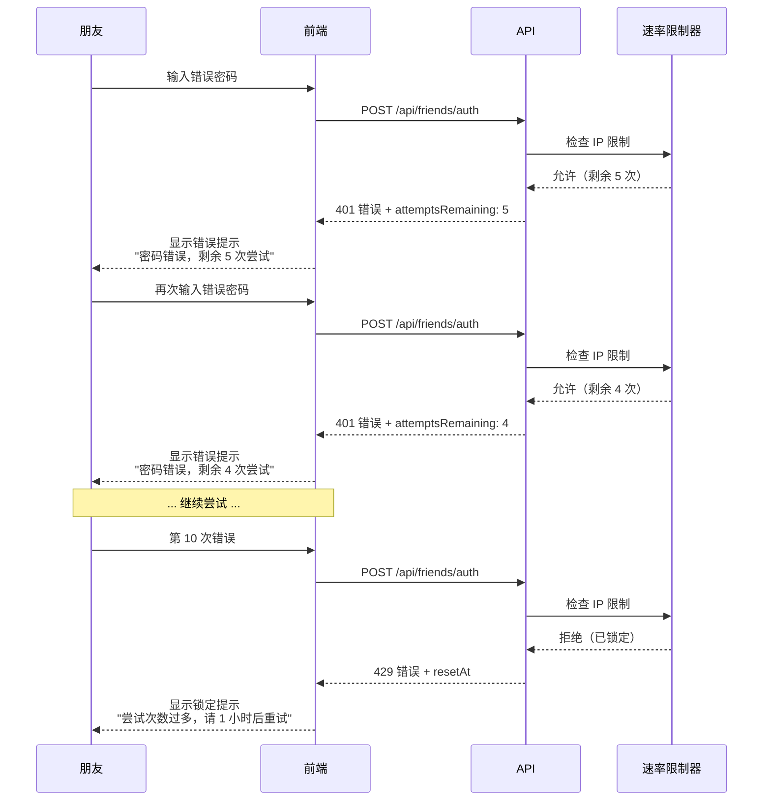

# 朋友故事功能 - 用户体验流程

> 本文档详细描述朋友访问流程和管理员操作流程，包含流程图和界面设计说明。

## 📋 目录

- [朋友访问流程](#朋友访问流程)
- [管理员操作流程](#管理员操作流程)
- [界面设计规范](#界面设计规范)
- [交互细节](#交互细节)
- [错误处理](#错误处理)

---

## 朋友访问流程

### 完整访问流程图

```mermaid
graph TB
    Start([朋友收到访问链接]) --> CheckURL{链接类型?}

    CheckURL -->|完整 URL| DirectLink[/zh/m/friends/alice]
    CheckURL -->|基础 URL| BaseLink[/zh/m/friends]

    DirectLink --> HasCookie{有有效 Cookie?}
    BaseLink --> ShowAuthPage[显示密码输入页面]

    HasCookie -->|是| ValidateCookie{Cookie 验证}
    HasCookie -->|否| Redirect1[重定向到密码页面<br/>?redirect=alice]

    ValidateCookie -->|有效| ShowStories[显示故事墙]
    ValidateCookie -->|无效/过期| Redirect2[重定向到密码页面<br/>?error=invalid-token]

    ShowAuthPage --> InputPassword[输入 Slug + 密码]
    Redirect1 --> InputPassword
    Redirect2 --> InputPassword

    InputPassword --> SubmitForm[提交表单]
    SubmitForm --> ValidateAPI{POST /api/friends/auth}

    ValidateAPI -->|密码正确| SetCookie[设置 Cookie<br/>friendAuth=JWT]
    ValidateAPI -->|密码错误| ShowError[显示错误<br/>剩余尝试次数]
    ValidateAPI -->|超过限制| ShowLocked[显示锁定提示<br/>请 1 小时后重试]

    ShowError --> Retry{重试?}
    Retry -->|是| InputPassword
    Retry -->|否| End1([结束])

    SetCookie --> RedirectStories[跳转到 /zh/m/friends/alice]
    RedirectStories --> ShowStories

    ShowStories --> ViewTimeline[浏览故事时间线]
    ViewTimeline --> LoadMore{还有更多?}

    LoadMore -->|是| ClickLoadMore[点击"加载更多"]
    LoadMore -->|否| ShowEnd[显示"已经到底了"]

    ClickLoadMore --> FetchMore[GET /api/moments?friendId=xxx&cursor=yyy]
    FetchMore --> AppendStories[追加故事到列表]
    AppendStories --> ViewTimeline

    ShowStories --> Logout{点击退出登录?}
    Logout -->|是| ClearCookie[清除 Cookie]
    ClearCookie --> RedirectAuth[返回密码页面]
    RedirectAuth --> End2([结束])

    ShowEnd --> End3([结束])

    ShowLocked --> End4([结束])
```

### 关键步骤详解

#### 步骤 1: 收到访问链接

**场景**：你通过微信、邮件等方式发送链接给朋友

**链接格式**：

```
https://yoursite.com/zh/m/friends

或

https://yoursite.com/zh/m/friends/alice?welcome
```

**提示文案示例**：

```
嗨 Alice！

我为你准备了一些特别的回忆，点击下面的链接查看：
https://yoursite.com/zh/m/friends

密码是我们第一次见面的地方（小写英文）
```

---

#### 步骤 2: 密码验证页面

**页面路径**: `/zh/m/friends`

**界面元素**：

```
┌─────────────────────────────────────┐
│                                     │
│         🌟 朋友故事                 │
│                                     │
│   输入密码查看为你准备的专属回忆     │
│                                     │
├─────────────────────────────────────┤
│                                     │
│  [🔑 朋友标识]                      │
│  ┌───────────────────────────────┐ │
│  │ alice                         │ │
│  └───────────────────────────────┘ │
│  请输入你收到的朋友标识             │
│                                     │
│  [🔒 密码]                          │
│  ┌───────────────────────────────┐ │
│  │ ••••••••                      │ │
│  └───────────────────────────────┘ │
│                                     │
│  [      查看故事      ] ← 按钮     │
│                                     │
└─────────────────────────────────────┘
```

**响应式设计**：

- 桌面端：居中卡片，最大宽度 500px
- 移动端：全屏布局，留 16px 边距

---

#### 步骤 3: 验证成功后跳转

**过渡动画**：

```typescript
// 平滑过渡
router.push("/zh/m/friends/alice");
// 添加淡入动画
className = "animate-fade-in";
```

**加载状态**：

- 显示 Loading 指示器
- 禁用表单防止重复提交
- 按钮文字变为"验证中..."

---

#### 步骤 4: 故事墙页面

**页面路径**: `/zh/m/friends/alice`

**界面布局**：

```
┌─────────────────────────────────────────────┐
│ [Avatar] Alice 的故事墙      [退出登录]     │
│          我们是高中同学                     │
└─────────────────────────────────────────────┘

┌─────────────────────────────────────────────┐
│ 🔒 专属故事                    2023-06-15   │
│                                              │
│ 还记得那个雨天吗？我们在咖啡厅聊到深夜...   │
│                                              │
│ [图片1] [图片2]                             │
│                                              │
│ 📍 星巴克 · 五角场店                        │
│ 🏷️ #回忆 #雨天                              │
└─────────────────────────────────────────────┘

┌─────────────────────────────────────────────┐
│ 🌍 公开故事                    2023-08-20   │
│                                              │
│ 我们的云南旅行！                            │
│                                              │
│ [图片]                                      │
└─────────────────────────────────────────────┘

         [  加载更多故事  ]
```

**视觉层级**：

1. **头部**：朋友信息，突出显示
2. **故事卡片**：清晰分隔，易于扫描
3. **徽章**：专属/公开，颜色区分
4. **加载更多**：明显但不突兀

---

### 错误处理流程

#### 密码错误



**错误提示文案**：

| 错误类型             | 提示文案                         | 操作建议         |
| -------------------- | -------------------------------- | ---------------- |
| 密码错误（还有尝试） | ❌ 密码错误，剩余 X 次尝试       | 检查大小写、空格 |
| 账户锁定             | 🔒 尝试次数过多，请 1 小时后重试 | 等待或联系管理员 |
| Slug 不存在          | ⚠️ 朋友标识不存在                | 检查链接是否正确 |
| 网络错误             | 🌐 网络错误，请稍后重试          | 检查网络连接     |
| Token 过期           | ⏰ 登录已过期，请重新输入密码    | 重新验证         |

---

## 管理员操作流程

### 创建朋友流程

```mermaid
graph TB
    Start([管理员登录后台]) --> AccessFriends[访问 /admin/friends]
    AccessFriends --> ClickCreate[点击"创建朋友"]

    ClickCreate --> ShowForm[显示创建表单]
    ShowForm --> FillForm[填写信息]

    FillForm --> FormFields{填写字段}

    FormFields --> Name[朋友昵称<br/>如: Alice]
    FormFields --> Slug[URL 标识<br/>如: alice]
    FormFields --> Password[密码<br/>自动生成或手动输入]
    FormFields --> Avatar[头像 URL<br/>可选]
    FormFields --> Description[关系描述<br/>如: 高中同学]

    Name --> ValidateForm{表单验证}
    Slug --> ValidateForm
    Password --> ValidateForm
    Avatar --> ValidateForm
    Description --> ValidateForm

    ValidateForm -->|通过| SubmitForm[提交表单]
    ValidateForm -->|不通过| ShowValidationError[显示验证错误]

    ShowValidationError --> FillForm

    SubmitForm --> CreateAPI[POST /api/admin/friends]
    CreateAPI --> SaveDB[保存到数据库]
    SaveDB --> ShowSuccess[显示成功提示]

    ShowSuccess --> CopyInfo[复制访问信息]
    CopyInfo --> ShareInfo[分享给朋友]

    ShareInfo --> InfoContent{分享内容}
    InfoContent --> ShareLink[访问链接<br/>https://site.com/zh/m/friends]
    InfoContent --> SharePassword[密码<br/>summer2024]
    InfoContent --> ShareSlug[朋友标识<br/>alice]

    ShareInfo --> End([完成])
```

### 发布故事流程

```mermaid
graph TB
    Start([访问故事创作页面]) --> CreateMoment[/admin/moments/create]
    CreateMoment --> FillContent[填写故事内容]

    FillContent --> ContentFields{内容字段}

    ContentFields --> Text[文字内容]
    ContentFields --> Images[上传图片]
    ContentFields --> Location[地理位置]
    ContentFields --> Tags[标签]
    ContentFields --> HappenedAt[故事发生时间]

    ContentFields --> VisibilityControl[可见性设置]

    VisibilityControl --> SelectVisibility{选择可见性}

    SelectVisibility -->|公开故事| PublicOption[✅ 所有朋友可见]
    SelectVisibility -->|专属故事| PrivateOption[🔒 仅特定朋友可见]
    SelectVisibility -->|完全私密| AdminOption[👁️ 仅管理员可见]

    PrivateOption --> SelectFriend[选择朋友<br/>下拉框]
    SelectFriend --> FriendSelected[已选: Alice]

    PublicOption --> ValidateStory{验证故事}
    AdminOption --> ValidateStory
    FriendSelected --> ValidateStory

    ValidateStory -->|通过| PublishStory[发布故事]
    ValidateStory -->|不通过| ShowError[显示错误]

    ShowError --> FillContent

    PublishStory --> SaveToDB[保存到数据库]
    SaveToDB --> Revalidate[重新验证缓存]
    Revalidate --> ShowSuccess[显示成功提示]

    ShowSuccess --> CheckFriend{是专属故事?}

    CheckFriend -->|是| NotifyFriend[可选：通知朋友]
    CheckFriend -->|否| End1([完成])

    NotifyFriend --> End2([完成])
```

---

## 界面设计规范

### 配色方案

```css
/* 主色调 */
--primary: #3b82f6; /* 蓝色 - 主要操作 */
--secondary: #8b5cf6; /* 紫色 - 次要操作 */

/* 可见性徽章 */
--public-badge: #10b981; /* 绿色 - 公开故事 */
--private-badge: #3b82f6; /* 蓝色 - 专属故事 */
--admin-badge: #6b7280; /* 灰色 - 完全私密 */

/* 状态颜色 */
--success: #10b981; /* 成功 */
--error: #ef4444; /* 错误 */
--warning: #f59e0b; /* 警告 */

/* 中性色 */
--gray-50: #f9fafb;
--gray-100: #f3f4f6;
--gray-500: #6b7280;
--gray-900: #111827;
```

### 字体排版

```css
/* 标题 */
h1 {
  font-size: 2rem; /* 32px */
  font-weight: 700;
  line-height: 1.2;
}

h2 {
  font-size: 1.5rem; /* 24px */
  font-weight: 600;
}

/* 正文 */
body {
  font-size: 1rem; /* 16px */
  line-height: 1.6;
}

/* 小字 */
.text-sm {
  font-size: 0.875rem; /* 14px */
}

.text-xs {
  font-size: 0.75rem; /* 12px */
}
```

### 间距系统

```css
/* Tailwind 间距 */
--spacing-1: 0.25rem; /* 4px */
--spacing-2: 0.5rem; /* 8px */
--spacing-3: 0.75rem; /* 12px */
--spacing-4: 1rem; /* 16px */
--spacing-6: 1.5rem; /* 24px */
--spacing-8: 2rem; /* 32px */
--spacing-12: 3rem; /* 48px */

/* 组件间距 */
.story-card {
  padding: var(--spacing-6);
  margin-bottom: var(--spacing-6);
}
```

### 圆角规范

```css
/* 圆角 */
--radius-sm: 0.375rem; /* 6px - 徽章 */
--radius-md: 0.5rem; /* 8px - 输入框 */
--radius-lg: 0.75rem; /* 12px - 卡片 */
--radius-full: 9999px; /* 完全圆形 - 头像 */
```

---

## 交互细节

### 动画效果

#### 页面过渡

```typescript
// 淡入动画
@keyframes fadeIn {
  from {
    opacity: 0;
    transform: translateY(10px);
  }
  to {
    opacity: 1;
    transform: translateY(0);
  }
}

.animate-fade-in {
  animation: fadeIn 0.3s ease-out;
}
```

#### 按钮状态

```css
/* 按钮 hover 效果 */
.btn-primary {
  background: #3b82f6;
  transition: all 0.2s ease;
}

.btn-primary:hover {
  background: #2563eb;
  transform: translateY(-1px);
  box-shadow: 0 4px 6px rgba(0, 0, 0, 0.1);
}

.btn-primary:active {
  transform: translateY(0);
}

/* 禁用状态 */
.btn-primary:disabled {
  opacity: 0.5;
  cursor: not-allowed;
  transform: none;
}
```

#### 加载状态

```typescript
// 加载指示器
<button disabled={loading}>
  {loading ? (
    <>
      <Spinner className="animate-spin" />
      <span>验证中...</span>
    </>
  ) : (
    '查看故事'
  )}
</button>
```

### 响应式断点

```css
/* 移动端优先 */
/* 默认: < 640px */

/* 平板 */
@media (min-width: 768px) {
  .container {
    max-width: 768px;
  }
}

/* 桌面端 */
@media (min-width: 1024px) {
  .container {
    max-width: 1024px;
  }
}

/* 大屏 */
@media (min-width: 1280px) {
  .container {
    max-width: 1280px;
  }
}
```

### 触摸优化

```css
/* 增大触摸目标 */
.touch-target {
  min-height: 44px; /* iOS 推荐 */
  min-width: 44px;
  padding: 12px 24px;
}

/* 禁用点击高亮 */
button {
  -webkit-tap-highlight-color: transparent;
}

/* 平滑滚动 */
html {
  scroll-behavior: smooth;
}
```

---

## 错误处理

### 错误类型和提示

| 错误代码 | 场景       | 提示文案                      | 操作             |
| -------- | ---------- | ----------------------------- | ---------------- |
| 400      | 缺少参数   | 请填写所有必需信息            | 检查表单         |
| 401      | 密码错误   | 密码错误，剩余 X 次尝试       | 重新输入         |
| 404      | 朋友不存在 | 朋友标识不存在，请检查链接    | 联系发送者       |
| 429      | 超过限制   | 尝试次数过多，请 1 小时后重试 | 等待或联系管理员 |
| 500      | 服务器错误 | 服务器错误，请稍后重试        | 刷新页面         |

### 用户友好的错误处理

```typescript
try {
  const res = await fetch("/api/friends/auth", {
    method: "POST",
    body: JSON.stringify({ slug, password }),
  });

  const data = await res.json();

  if (!res.ok) {
    // 根据状态码显示不同提示
    switch (res.status) {
      case 401:
        setError(`密码错误，剩余 ${data.attemptsRemaining} 次尝试`);
        break;
      case 429:
        setError("尝试次数过多，请稍后再试");
        break;
      case 404:
        setError("朋友标识不存在，请检查链接");
        break;
      default:
        setError("验证失败，请稍后重试");
    }
    return;
  }

  // 成功处理
  router.push(`/zh/m/friends/${slug}`);
} catch (error) {
  // 网络错误
  setError("网络错误，请检查连接后重试");
}
```

---

## 可访问性（A11y）

### 键盘导航

```typescript
// 表单支持 Enter 提交
<form onSubmit={handleSubmit}>
  <input onKeyDown={(e) => {
    if (e.key === 'Enter') {
      handleSubmit(e)
    }
  }} />
</form>

// 焦点管理
const inputRef = useRef<HTMLInputElement>(null)

useEffect(() => {
  inputRef.current?.focus()  // 自动聚焦到密码输入框
}, [])
```

### 屏幕阅读器

```tsx
// ARIA 标签
<button
  aria-label="查看故事"
  aria-busy={loading}
  aria-disabled={loading}
>
  查看故事
</button>

<div
  role="alert"
  aria-live="polite"
>
  {error && error}
</div>
```

### 颜色对比度

```css
/* WCAG AA 标准 */
/* 正常文字: 4.5:1 */
/* 大字体: 3:1 */

.text-primary {
  color: #111827; /* 与白色背景对比 16:1 ✅ */
}

.text-secondary {
  color: #6b7280; /* 与白色背景对比 4.6:1 ✅ */
}
```

---

## 总结

本文档涵盖：

✅ **完整流程**：朋友访问、管理员操作的详细流程图
✅ **界面设计**：配色、字体、间距、圆角规范
✅ **交互细节**：动画、响应式、触摸优化
✅ **错误处理**：友好的错误提示和恢复流程
✅ **可访问性**：键盘导航、屏幕阅读器、对比度

通过这些规范，确保"朋友故事页面"提供一致、友好、易用的用户体验！
